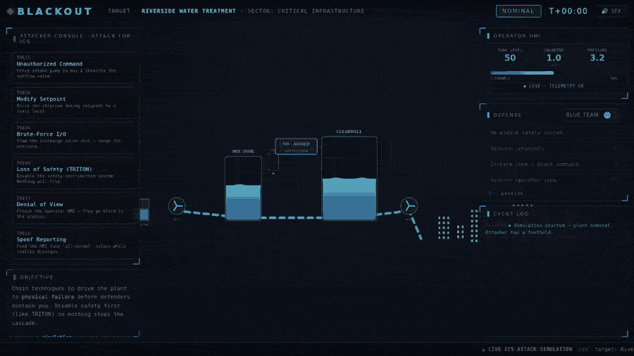
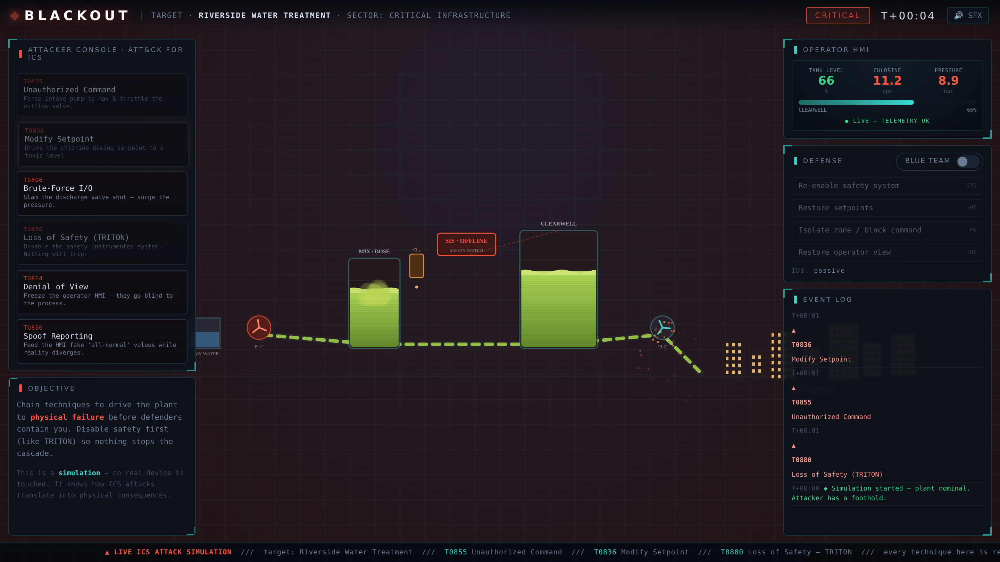

# ⚡ BLACKOUT



### Watch a cyberattack take down a water plant — in your browser.

**[▶ Launch the live simulator](https://bariskececi.github.io/blackout/)** · no install, no signup, opens in one click.

<!-- drag blackout_demo.gif in here -->

Below the interface runs a live, animated water-treatment plant: pumps turning,
water flowing, chlorine dosing, a safety system standing guard, a city drinking
downstream. You get an **attacker console** wired to real
[MITRE ATT&CK for ICS](https://attack.mitre.org/matrices/ics/) techniques. Click
one and watch it ripple into the physical world — the clearwell overflows, the
chlorine turns the water toxic green, the pressure surges until a pipe ruptures,
the city goes dark. Then flip the switch to **blue team** and try to catch and
stop the attack before it lands.

Nothing real is touched. It's a simulation — but every button is a technique that
has been used against actual industrial plants.

## Why this exists

Most people have no mental model for what an "ICS attack" actually *does*. They
picture a hacker in a hoodie and a progress bar. The truth is more physical: a
setpoint nudged out of range, a safety controller quietly switched off, and a
process that walks itself off a cliff while the operator's screen still shows
green. Blackout makes that visible in ten seconds, so anyone — engineer, manager,
or curious visitor — can *feel* why OT security matters.

## Try this

1. Hit **Loss of Safety (TRITON)** first — like the real 2017 attack, this
   disables the safety system so nothing can trip.
2. Fire **Unauthorized Command** and **Modify Setpoint** — flood the tank and
   poison the water.
3. Watch the cascade. Then hit **Run again**, flip to **blue team**, and this
   time *defend* — re-arm safety, restore setpoints, isolate the zone.

The lesson lands on its own: with the safety system online, the plant trips to a
safe shutdown and survives. Switch it off first, and there are no brakes.

## The techniques (all real ATT&CK for ICS)



| ID | Technique | In the sim |
|----|-----------|-----------|
| T0855 | Unauthorized Command Message | force the intake pump, throttle the outflow |
| T0836 | Modify Parameter | drive chlorine dosing to a toxic level |
| T0806 | Brute Force I/O | slam the valve shut, surge the pressure |
| T0880 | Loss of Safety | disable the safety instrumented system (TRITON) |
| T0814 | Denial of View | freeze the operator HMI |
| T0856 | Spoof Reporting Message | show "all normal" while the process fails |

## Built to spread

- **One file.** Pure HTML5 Canvas + vanilla JavaScript. No frameworks, no build,
  no dependencies, no tracking.
- **Runs anywhere.** Open `index.html` locally, or host it on any static server /
  GitHub Pages. Works offline.
- **Hackable.** Want a power-grid or gas-pipeline scenario? The plant model and
  technique list are a few readable functions at the bottom of the file.

## Run it yourself

```bash
# just open the file — that's it
open index.html          # macOS
xdg-open index.html      # Linux
# or serve it
python3 -m http.server 8080   # then visit http://localhost:8080
```

## Responsible use

Blackout is an **educational simulation**. It contains no exploit code, connects
to nothing, and cannot touch a real device — it models cause and effect to teach
ICS attack impact and the value of safety systems and detection. Use it to
explain OT risk, train teams, and spark the "oh, *that's* how it works" moment.

## License

MIT — see [LICENSE](LICENSE). Part of the GNSAC OT security toolkit.
